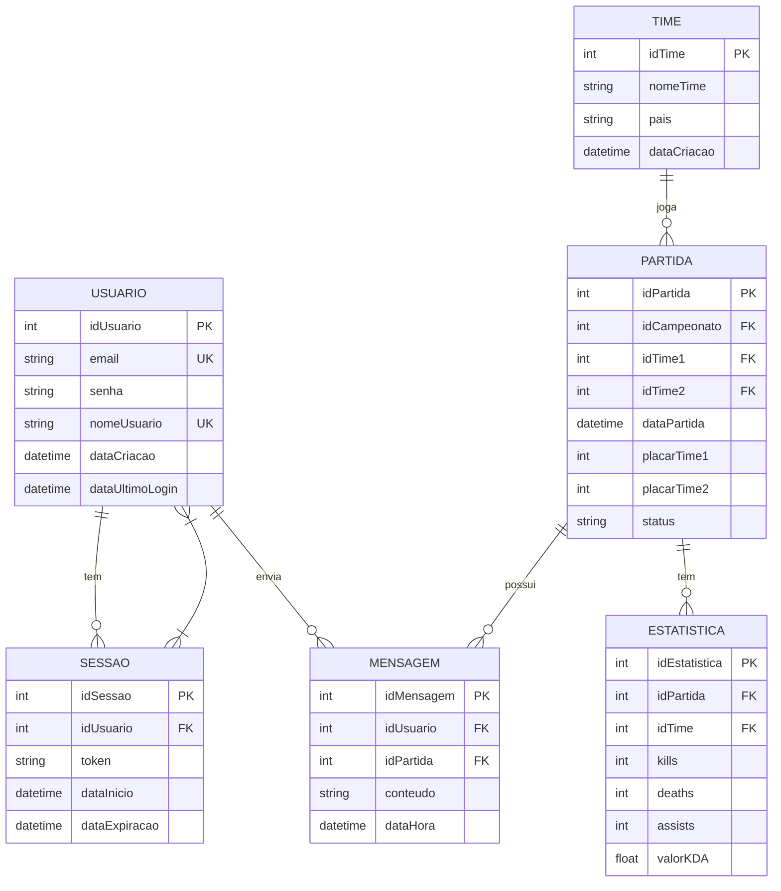

# 🛠️ Especificação Técnica (Tech Spec) - PlaceHolder

Este documento detalha a arquitetura técnica, o modelo de dados e os contratos de API (via JSON Server) necessários para o funcionamento do sistema bancário Roubank.

## 1. Modelo de Dados (Diagrama ER)

Abaixo está o Diagrama Entidade-Relacionamento (DER) que representa a estrutura do nosso "banco de dados" (`db.json`) e como as informações se conectam.



## 2. Dicionário de Dados

Breve explicação das tabelas principais:

Usuário:
Responsável por armazenar os dados de autenticação e identificação dos usuários do sistema.

idUsuario: Identificador único do usuário (PK).
email: Email do usuário, utilizado para login. Deve ser único (UK).
senha: Senha do usuário (idealmente armazenada com hash).
nomeUsuario: Nome exibido no sistema, também único (UK).
dataCriacao: Data de criação da conta.
dataUltimoLogin: Último acesso do usuário ao sistema.

Sessão:
Gerencia as sessões ativas dos usuários, permitindo controle de autenticação contínua.

idSessao: Identificador único da sessão (PK).
idUsuario: Chave estrangeira que vincula a sessão ao usuário (FK).
token: Token de autenticação da sessão.
dataInicio: Momento em que a sessão foi iniciada.
dataExpiracao: Momento em que a sessão expira.

Time:
Armazena informações sobre os times profissionais.

idTime: Identificador único do time (PK).
nomeTime: Nome da equipe.
pais: País de origem do time.
dataCriacao: Data de fundação ou registro do time no sistema.

Partida:
Representa uma partida entre dois times dentro de um campeonato.

idPartida: Identificador único da partida (PK).
idCampeonato: Identificador do campeonato (FK, mesmo não estando detalhado no diagrama).
idTime1 / idTime2: Times participantes da partida (FK).
dataPartida: Data e hora em que a partida ocorreu.
placarTime1 / placarTime2: Número de rounds vencidos por cada time.
status: Situação da partida (ex: "agendada", "em andamento", "finalizada").

Mensagem:
Armazena mensagens enviadas pelos usuários, geralmente relacionadas a partidas (ex: comentários).

idMensagem: Identificador único da mensagem (PK).
idUsuario: Usuário que enviou a mensagem (FK).
idPartida: Partida associada à mensagem (FK).
conteudo: Texto da mensagem.
dataHora: Data e hora do envio.

Estatística:
Registra o desempenho individual de um time em uma partida específica.

idEstatistica: Identificador único do registro (PK).
idPartida: Partida relacionada (FK).
idTime: Time ao qual os dados pertencem (FK).
kills: Total de eliminações.
deaths: Total de mortes.
assists: Total de assistências.
valorKDA: Indicador de desempenho (Kill/Death/Assist), geralmente calculado.

## 3. Tecnologias: 

- **Framework** - Bootstrao versão 5.3.8
- **Api** - Liquipedia versão 1.0.12
- **Agentes de IA** - Mermaid.ia, Chatgpt e Stitch.IA

## 4. Rotas da API (JSON Server)

A aplicação consome a API local simulada pelo JSON Server. Abaixo os principais endpoints:

- `GET /usuarios` - Retorna a lista de usuários.
- `POST /usuarios` - Cadastra um novo usuário.
- `GET /transacoes?id_usuario=1` - Retorna o extrato de um usuário específico.

## 5. Estrutura do Banco de Dados (db.json)

Esta é a representação em formato JSON do banco de dados simulado. Esta estrutura serve de contexto para ferramentas de IA e para o JSON Server inicializar a API Fake.

```JSON
{
    "clientes": [
    {
        "id": "1",
        "nome": "João da Silva",
        "cpf": "12345678900",
        "senha": "senha_super_segura",
        "saldo": 850.50
    }],
    "transacoes": [
    {
        "id": "1",
        "clienteId": "1",
        "tipo": "DEPOSITO",
        "valor": 1000.00,
        "data": "2026-03-16",
        "descricao": "Depósito inicial em espécie"
    },
    {
        "id": "2",
        "clienteId": "1",
        "tipo": "TAXA",
        "valor": 50.00,
        "data": "2026-03-16",
        "descricao": "Taxa de boas-vindas do Roubank"
    },
    {
        "id": "3",
        "clienteId": "1",
        "tipo": "SAQUE",
        "valor": 99.50,
        "data": "2026-03-17",
        "descricao": "Saque no caixa eletrônico"
    }]
}
```
